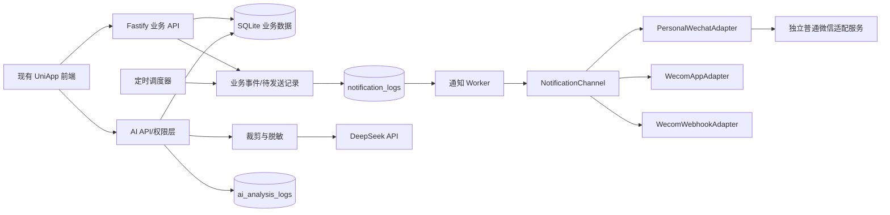
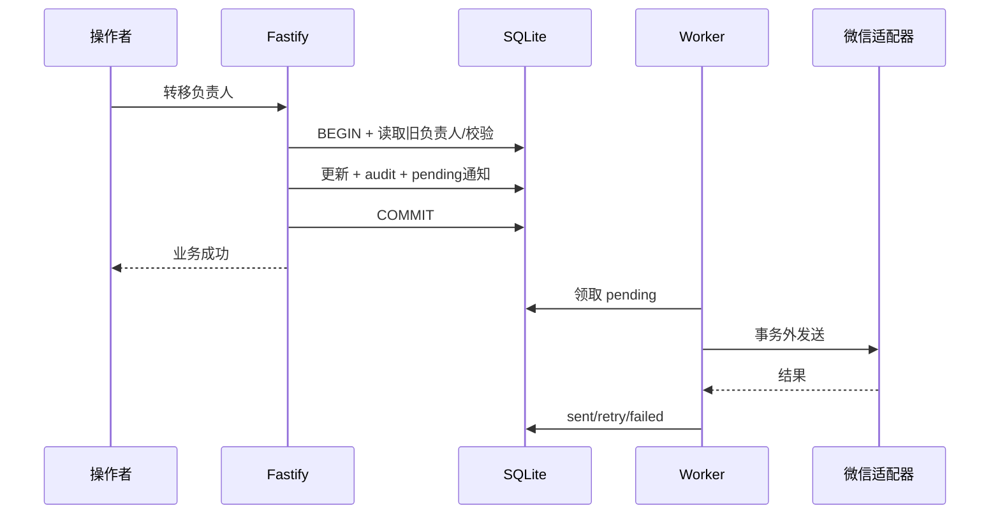

# XYY-xiansuo 智能销售助手技术设计

> **后续决策覆盖说明（2026-08-01）：** 用户决定取消企业微信自建应用并暂停所有真实外部消息渠道；OpenClaw daemon 与 Direct iLink 为 No-Go，Hook/RPA/逆向/Windows 自动化继续禁止。本文中普通微信、企业微信、降级/fallback、PoC、Gateway 和相关迁移的设计/计划均不是当前计划，只保留为历史方案。现行正式通知仅为 H5 站内通知，Mock 仅用于测试/灰度；阶段三 outbox、通知规则、租约、重试、TTL、审计及阶段四 DeepSeek 调度、`scheduled_follow_overdue`、`daily_report`、AI 审计和模板降级保留，但不向真实外部渠道发送。迁移 `007`、`notification_deliveries`、`notification_channel_bindings` 暂缓，不进入实现，不补发。只有官方普通微信提供独立 client/session 且支持主动通知，或用户批准公众号/服务号/其他合法官方渠道后，才可重新审计。

> 文档性质：设计方案，不是实现
> 修订日期：2026-07-30
> 约束：本阶段不修改业务代码、不迁移数据库、不接入微信或 DeepSeek

## 1. 设计目标

本次扩展需要同时满足：

1. 只把确实需要处理的重要事件通知给相关人员；
2. 目标触达端是普通微信，企业微信是稳定备用和降级通道；
3. AI 只读取后端授权数据并生成辅助文本；
4. 微信、AI 或 worker 失败不影响原线索系统；
5. 不引入客户价值评分和新的五级销售阶段；
6. 不破坏已有 API 和业务流程。

## 2. 明确不做

第一阶段不做：

- 普通新增线索通知；
- 普通字段、标签、收藏、备忘变化通知；
- `sales_stage` 字段、五级销售阶段 API 或通知；
- 24/48/72 小时“最后活动”规则冒充约定跟进逾期；
- AI 客户价值评分、A/B/C 分类、成交概率；
- AI 写数据库、调用 Shell、文件系统或管理接口；
- 把某个个人微信开源项目直接定为生产依赖；
- 把企业微信改成唯一正式渠道。

## 3. 推荐整体架构



### 3.1 模块职责

| 模块 | 职责 | 禁止事项 |
| --- | --- | --- |
| 业务 API | 权限校验、业务更新、事务内写审计和待发送记录 | 事务内调用微信或 DeepSeek |
| 定时调度器 | 计算到期、拜访、日报和周报事件 | 直接发送、绕过规则 |
| 通知 Worker | 领取任务、重试、限流、记录结果 | 修改线索业务结果 |
| 渠道接口 | 把统一消息转换为具体渠道请求 | 包含业务判断 |
| 普通微信适配服务 | 保持登录、收发消息、连接状态和回调 | 与主 Fastify 进程同生共死 |
| AI 服务 | 后端取数、裁剪、调用模型、记录审计 | 接受前端拼装客户上下文为事实 |
| DeepSeek | 生成只读分析文本 | 获得数据库、secret 或系统工具 |

### 3.2 故障隔离

- 业务事务只持久化待发送记录；
- 微信发送在事务提交后异步执行；
- 外部发送失败不回滚负责人、状态或跟进；
- worker 崩溃后由 pending/failed 状态恢复；
- 普通微信适配器单独运行，掉线不拖垮主系统；
- AI 超时只返回可重试错误，日报仍可使用 SQL 纯数据版；
- 企业微信可作为普通微信失败时的人工或自动降级通道。

## 4. 业务事件设计

### 4.1 统一事件类型

第一阶段事件：

```text
owner_changed
scheduled_follow_overdue
visit_reminder
status_changed
daily_report
weekly_report
```

后续可选且默认关闭：

```text
inactive_lead
```

不包含 `lead_created` 和 `sales_stage_changed`。

### 4.2 事件生成原则

业务写入类事件应在同一 SQLite 事务内完成：

```text
读取旧状态
→ 校验身份和数据权限
→ 更新业务数据
→ 写 audit_logs
→ 计算是否满足通知规则
→ 写 notification_logs(pending/suppressed)
→ 提交
```

定时类事件由 scheduler 只读扫描后，以唯一幂等键插入。重复扫描不得产生重复通知。

### 4.3 负责人变更

触发条件：

```text
old_owner_id != new_owner_id
AND new_owner_id != actor_user_id
```

适用于：

- 管理员单条或批量转给业务员；
- 业务员把自己负责的线索转给其他业务员；
- 后续新增的合法管理入口。

默认抑制：

- 公海认领给自己；
- 操作者转移给自己；
- 新旧负责人相同；
- 重复提交；
- 新负责人不存在、已停用或权限校验失败。

接收人只有新负责人。消息只包含客户显示名、原负责人、新负责人、当前 status 和系统详情入口。手机号、微信号、完整跟进内容默认不进入通知。

幂等键示例：

```text
owner_changed:{operation_id}:{lead_id}:{new_owner_id}
```

批量转移必须逐条读取和记录，不允许继续使用“单条批量 UPDATE、无逐条审计”的现状。

### 4.4 约定跟进到期与逾期

第一版沿用现有业务含义：

```text
当前存在 next_follow_at
并且到达或超过约定日期
并且该约定尚未被新的有效跟进完成/替换
并且客户未结束
```

`next_follow_at` 当前是 `YYYY-MM-DD` 日期，不能准确计算到小时。建议按日级别：

| 级别 | 示例条件 | 默认接收人 |
| --- | --- | --- |
| due_today | `next_follow_at = today`，在配置时间扫描 | 当前负责人 |
| overdue_1d | 逾期 1 个自然日 | 当前负责人 |
| overdue_2d | 逾期 2 个自然日 | 配置的管理员，可同时抄送负责人 |
| overdue_3d_plus | 逾期 3 天或指定天数 | 配置的管理人员 |

默认停止状态：

```text
已成交、已流失、停止跟进
```

“暂搁置”是否提醒由规则配置，不能硬编码。

当前模型中 `leads.next_follow_at` 代表当前待办日期。新的有效跟进应在同一事务中把它替换为新的日期或清空；编辑/删除最新跟进时必须重算。完成这项一致性修复前，不得上线定时逾期发送。

幂等键示例：

```text
scheduled_follow_overdue:{lead_id}:{due_date}:{level}:{recipient_user_id}
```

若 due_date 被修改、清空，产生新跟进，负责人变化或状态结束，旧 pending 任务应被取消/失效。

### 4.5 长期未跟进

该概念独立使用：

```sql
COALESCE(last_follow_at, created_at)
```

它表示“长期没有活动”，而不是“错过约定日期”。设计为 `inactive_lead`：

- 默认关闭；
- 不纳入首个 MVP 强制范围；
- 可用于公海、客户沉默或管理提醒；
- 使用独立阈值、接收人和幂等键；
- 文案不得称为“约定跟进逾期”。

### 4.6 拜访提醒

未来拜访使用独立 `visit_plans`，不复用已发生的 `follow_ups.type = 拜访`。

状态：

```text
planned、completed、cancelled
```

可配置提醒：

- 前一天；
- 当天；
- 开始前 N 分钟。

修改计划后，旧版本提醒失效；取消或完成后，所有未发送提醒取消。幂等键应包含 `visit_plan_id`、计划版本/更新时间和提醒级别。

member 只能管理自己负责客户且由自己负责的拜访计划；admin 按现有管理权限操作。客户负责人变化时，计划负责人如何迁移需要业务确认，默认不自动迁移。

### 4.7 现有关键状态提醒

第一阶段只监听 `leads.status` 的真实变化。可配置重点状态：

```text
已报价、已成交、已流失、停止跟进
```

默认只启用少量状态。每个规则配置接收策略，例如负责人、指定管理员或二者。重复提交相同 status 不生成事件。

不新增销售阶段字段，不把“咨询→需求确认→方案沟通→报价→成交”作为前置。

### 4.8 日报和周报

所有数字由 SQL 确定性统计：

- 完成跟进数；
- 有跟进的客户数；
- 当前约定跟进逾期数；
- 当日拜访计划；
- 已报价、已成交、已流失等关键状态变化；
- 待处理问题。

AI 只接收结构化统计和少量脱敏摘要，用于文字总结。模型失败时仍发送纯数据版本。模型输出不能覆盖、重算或修改 SQL 数字。

member 只能生成/接收自己的报告；admin 的公司级报告必须经过专用后端权限校验。

## 5. 通知规则、队列与发送

### 5.1 规则模型

`notification_rules` 至少支持：

- event_type；
- enabled；
- recipient_strategy；
- channel preference；
- day/time/threshold 配置；
- status 白名单；
- 暂搁置是否抑制；
- quiet hours；
- updated_by 和版本。

规则参数使用受版本控制的 JSON schema 校验，不能让任意 JSON 直接进入 scheduler。

### 5.2 持久化队列

第一阶段可由 `notification_logs` 同时承担 outbox 和发送日志：

```text
pending → sending → sent
                  ↘ retry_wait → sending
                  ↘ failed
pending → cancelled/suppressed
```

领取任务要使用原子条件更新；`sending` 超时可回收。重试采用有限次数和指数退避，永久错误直接 failed。管理员可以查看和手动重试单条失败任务，但重试仍受原幂等键约束。

### 5.3 渠道接口

职责接口示意：

```text
NotificationChannel
├── PersonalWechatAdapter
├── WecomAppAdapter
└── WecomWebhookAdapter
```

接口只接受统一的脱敏消息：

```text
send(recipient, message, idempotencyKey) -> deliveryResult
health() -> channelHealth
```

业务服务不导入任何 Wechaty、Hook、RPA 或企业微信 SDK。

### 5.4 降级规则

推荐按用户/事件配置渠道顺序：

```text
personal_wechat → wecom_app → wecom_webhook → 仅保留站内待办
```

是否自动降级要区分：

- 临时超时：先重试，不立即双发；
- 明确掉线或会话窗口失效：可降级；
- 永久无绑定：按配置降级；
- 高风险事件：可在达到最大等待后走备用通道。

必须防止同一事件在多个渠道重复轰炸。成功发送一个渠道后，其余候选渠道取消，除非规则明确要求多渠道。

## 6. 普通微信机器人专项调研

### 6.1 调研口径

以下数据来自 2026-07-30 对 GitHub 仓库、README、Release、最近提交和公开 Issue 的核对。Star/Fork 是动态快照，不应作为唯一选型依据。

“普通微信”分为两类：

1. 普通微信用户与一个 Bot 联系人对话，例如腾讯 iLink/ClawBot；
2. 自动控制一个普通个人微信账号，例如 Windows RPA 或客户端 Hook。

两类能力、风险和主动发送限制不同，不能混为一谈。

### 6.2 仓库与活跃度

| 候选 | 仓库 | 最近提交 | 最近 Release | Star / Fork | 协议 / 语言 |
| --- | --- | --- | --- | ---: | --- |
| Tencent iLink 插件 | [Tencent/openclaw-weixin](https://github.com/Tencent/openclaw-weixin) | 2026-06-25，提交标记 v2.4.6 | 无 GitHub Release | 719 / 130 | MIT（LICENSE），TypeScript |
| OpeniLink Hub | [openilink/openilink-hub](https://github.com/openilink/openilink-hub) | 2026-06-18 | v0.1.36，2026-06-18 | 1,525 / 129 | MIT，Go |
| iLink Node/Python SDK | [epiral/weixin-bot](https://github.com/epiral/weixin-bot) | 2026-03-22 | 无 | 465 / 53 | README/package 声称 MIT，但仓库无 LICENSE；Python/TypeScript |
| WeChatAuto.SDK | [scottfly189/WeChatAuto.SDK](https://github.com/scottfly189/WeChatAuto.SDK) | 2026-07-28 | 1.2.9，2026-04-13 | 224 / 64 | MIT，C# / Python |
| pywechat / pyweixin | [Hello-Mr-Crab/pywechat](https://github.com/Hello-Mr-Crab/pywechat) | 2026-07-25 | 无 | 1,756 / 477 | LGPL-2.1，Python |
| WeChatFerry | [lich0821/WeChatFerry](https://github.com/lich0821/WeChatFerry) | 2026-03-21 | v39.5.2，2026-03-28 | 6,799 / 1,575 | MIT，C++；仓库已归档 |
| wxauto | [cluic/wxauto](https://github.com/cluic/wxauto) | 2026-04-13（README） | 无 | 7,211 / 1,371 | Apache-2.0，Python |
| Gewechat | [Devo919/Gewechat](https://github.com/Devo919/Gewechat) | 2026-02-13（停止说明） | 无 | 3,481 / 691 | Apache-2.0，Java 客户端/镜像 |
| Wechaty + Web puppet | [wechaty/wechaty](https://github.com/wechaty/wechaty) / [puppet-wechat](https://github.com/wechaty/puppet-wechat) | core 2025-12-21；puppet 2022-07-14 | core v0.56，2021-01-25；puppet 无 | 22,937 / 2,832；444 / 73 | Apache-2.0，TypeScript |

### 6.3 能力、部署和接入

| 候选 | 普通微信与收发 | 登录/在线与恢复 | Linux / Docker | Node、HTTP、Webhook | Fastify 接入难度 |
| --- | --- | --- | --- | --- | --- |
| Tencent iLink 插件 | 普通微信里的 Bot 联系人；收消息、文本/媒体回复；发送必须带会话 `context_token`，不能仅凭用户 ID 任意主动推送 | 手机扫码授权；凭证本地保存；session 失效需重新扫码；需要长轮询常驻 | 插件随 OpenClaw 运行，可在其支持环境部署 | TypeScript、HTTP JSON；官方实现绑定 OpenClaw | 协议层低，但直接引入 OpenClaw 不符合本项目最小权限，需要独立适配服务 |
| OpeniLink Hub | 基于 iLink 的 Bot；支持收发、Webhook/WebSocket；公开说明存在 24 小时窗口 | 扫码绑定；窗口不能后台静默续期，需要用户回复；多 Bot 管理 | 原生 Linux、Docker/Compose | Webhook、WebSocket、Node 等多语言 SDK | 低到中，适合隔离 PoC；但属于社区独立实现 |
| epiral/weixin-bot | iLink Bot；可收消息；所谓主动 send 仍要求已有 `context_token` | 扫码；凭证保存；`-14` 时重新登录 | Node/Python 可在 Linux；无官方 Docker | Node SDK、Python；无业务 Webhook 网关 | 低，Node >=22 与当前项目匹配；成熟度和许可文件不足 |
| WeChatAuto.SDK | 控制普通个人微信客户端；主动给指定联系人发送并监听消息 | 微信客户端长期登录；UI 树/OCR；断线和客户端升级依赖 Windows 环境 | 不支持 Linux/Mac；无原生 Docker | .NET/Python；社区 WebSocket Server | 中，需要独立 Windows 服务；社区版与 VIP 能力有差异 |
| pywechat / pyweixin | 控制普通个人微信；可主动发消息并监听 | PC 微信长期登录；UIAutomation；Issue 有强制下线、发送未落地、UI 不可见 | Windows 7/10/11；无原生 Linux/Docker | Python API，无内置 HTTP/Webhook | 中高，需要自行封装 Windows adapter |
| WeChatFerry | Windows Hook 普通个人微信；主动发送和接收；有 Python/HTTP/Node 客户端 | 指定微信客户端版本长期登录；升级需重新适配；仓库已归档 | 核心是 Windows；Docker 为社区包装 | HTTP、Node、Python 齐全 | 技术接入低，但维护/风控风险高 |
| wxauto | Windows 3.9.x UIAutomation，可简单收发 | 长期保持桌面微信登录，受窗口和版本影响 | Windows；无原生 Linux/Docker | Python，无内置 HTTP/Webhook | 中高 |
| Gewechat | 曾支持 iPad 登录、主动发送、回调接收 | 扫码、appId、同省网络、镜像常驻 | Linux/Docker，但要求 privileged 和特定镜像 | REST API / 回调 | 表面低，但项目明确已不可用 |
| Wechaty | core 只是统一框架；普通微信能力完全取决于 puppet | QR 和恢复取决于 provider；旧 Web puppet 有 UOS/Web API 限制 | core 支持 Linux/Docker | Node 生态友好 | core 低、可用个人微信 puppet 风险和成本未知 |

### 6.4 付费、合规、风控和严重问题

| 候选 | 非官方协议/付费依赖 | 多设备与封号风险 | 已知严重问题 | 企业内部生产判断 |
| --- | --- | --- | --- | --- |
| Tencent iLink 插件 | 腾讯官方仓库和插件；不控制个人账号；MIT | 协议合规风险最低；但会话能力受服务端策略限制 | Issue 已有 `context_token` 过期发送 `ret=-2`、群聊能力请求、媒体和版本问题 | 最值得优先 PoC；是否满足定时主动通知尚未证明 |
| OpeniLink Hub | 自述基于公开 iLink 独立开发且未经官方授权；免费开源 | 不注入客户端，封号风险低于 Hook/RPA；仍受 iLink 服务策略约束 | 24 小时窗口不能静默续期；群聊/转发能力仍有公开 Issue；托管站稳定性有投诉 | 可作隔离 PoC 和适配参考，暂不直接承诺生产 |
| epiral/weixin-bot | 社区对 iLink 的协议整理；无付费；仓库 LICENSE 文件缺失 | 与 iLink 相同，不控制个人号 | 只有早期提交；必须已有 context_token；session 需重新扫码 | 适合协议验证，不宜直接成为生产依赖 |
| WeChatAuto.SDK | UIAutomation，不是逆向协议；20% 高级 API/VIP，WebSocket 二进制社区包 | 自动化频率仍可能触发风控；同账号多设备影响需实测 | 新版依赖 UI Tree + OCR；官方 README 明示风控；Windows 单点 | 仅作为备选 PoC；生产需专机、专号和法律/运维接受 |
| pywechat / pyweixin | UIAutomation，无 Hook；无必需付费组件 | README 要求遵守微信条款；公开 Issue 有周期性强制下线 | UI 不可见、发送内容未真正发出、夜间掉线、联系人定位问题 | 测试/个人自动化更合适，不作为首选生产通道 |
| WeChatFerry | 客户端 DLL 注入/Hook，非官方 | 高；绑定特定客户端版本，多设备和升级行为不可控 | 仓库已归档；只适配 3.9.12.51，Issue 询问 4.x；免责声明限学习研究/非商业 | 不推荐企业生产 |
| wxauto | UIAutomation；免费 | 中高，版本锁定 3.9.x | README 明确禁止实际生产项目和商业用途 | 不进入企业 PoC 候选 |
| Gewechat | 非官方 iPad 协议/闭源镜像部分，曾免费 | 高，要求同省、频繁新设备可能异常 | README 首行明确“因相关法律原因，本项目不再维护及可用”，且禁止商用 | 排除 |
| Wechaty | puppet 可能是非官方协议、付费 token 或服务 | 取决于 provider，不能用 core Star 数掩盖 provider 风险 | `puppet-wechat` 2022 后无提交、Web API 能力受限；core GitHub release 老旧 | 没有通过审核的 puppet 前不作为方案 |

关键证据入口：

- Tencent iLink 插件：[README/API 说明](https://github.com/Tencent/openclaw-weixin)、[`context_token` 过期发送失败 Issue #225](https://github.com/Tencent/openclaw-weixin/issues/225)、[群聊能力请求 Issue #236](https://github.com/Tencent/openclaw-weixin/issues/236)；
- OpeniLink Hub：[免责声明和 24 小时窗口说明](https://github.com/openilink/openilink-hub)、[v0.1.36](https://github.com/openilink/openilink-hub/releases/tag/v0.1.36)、[群聊 Issue #237](https://github.com/openilink/openilink-hub/issues/237)、[转发限制 Issue #239](https://github.com/openilink/openilink-hub/issues/239)；
- WeChatAuto.SDK：[README 的 Windows、风控和 VIP 说明](https://github.com/scottfly189/WeChatAuto.SDK)、[1.2.9 Release](https://github.com/scottfly189/WeChatAuto.SDK/releases/tag/1.2.9)；
- pywechat/pyweixin：[README](https://github.com/Hello-Mr-Crab/pywechat)、[周期性强制下线 Issue #268](https://github.com/Hello-Mr-Crab/pywechat/issues/268)、[发送未落地 Issue #277](https://github.com/Hello-Mr-Crab/pywechat/issues/277)；
- WeChatFerry：[归档仓库与版本说明](https://github.com/lich0821/WeChatFerry)、[v39.5.2](https://github.com/lich0821/WeChatFerry/releases/tag/v39.5.2)、[4.x 支持 Issue #421](https://github.com/lich0821/WeChatFerry/issues/421)；
- wxauto 的[生产/商业禁用声明](https://github.com/cluic/wxauto)和 Gewechat 的[停止维护及不可用声明](https://github.com/Devo919/Gewechat)；
- Wechaty 的普通微信能力需结合具体 puppet 审核，旧 Web provider 的[已知限制](https://github.com/wechaty/puppet-wechat#known-limitations)不能由 core 项目热度抵消。

### 6.5 普通微信与企业微信风险对比

| 维度 | iLink 普通微信 Bot | 个人号 RPA/Hook | 企业微信自建应用 | 企业微信群 Webhook |
| --- | --- | --- | --- | --- |
| 老板使用普通微信 | 是 | 是 | 需使用企业微信或互通能力 | 需在企业微信群 |
| 主动定时通知 | 受 context_token/窗口限制，必须 PoC | 通常可发，但依赖客户端在线 | 官方定向消息，能力清晰 | 只能发到固定群 |
| 官方/合规 | 腾讯官方插件路线较好；社区封装仍需审查 | 非官方自动化，风险高 | 官方 API | 官方 API |
| 登录稳定性 | session/窗口和扫码限制 | 客户端、UI、版本、掉线影响大 | access token 可刷新 | webhook 密钥稳定 |
| Linux/Docker | 可 | 多数不可，通常需 Windows 专机 | 可 | 可 |
| 封号风险 | 相对低但仍受平台策略 | 中高到高 | 低 | 低 |
| 接入成本 | 中，能力边界待验证 | 中高，长期运维成本高 | 低到中 | 最低 |
| 适合生产 | PoC 通过后再判断 | 通常不推荐核心生产通知 | 适合作稳定备用/正式降级 | 适合管理群降级 |

### 6.6 推荐结论

当前不能把任何普通微信方案直接写成正式生产方案。建议：

1. **首选普通微信 PoC：腾讯官方 `openclaw-weixin` / iLink 能力。** 使用完全隔离的测试环境，验证普通微信 Bot 联系人能否满足指定用户绑定、定时主动通知、24 小时后发送、掉线和恢复。PoC 不连接生产数据，也不授予 OpenClaw 任何业务或系统工具。
2. **独立接入评估：OpeniLink Hub 或窄化 iLink adapter。** OpeniLink 有 Linux、Docker、Webhook，适合快速验证 Fastify 对接；但其免责声明明确未获 iLink 官方授权，只能作为 PoC 候选。若未来存在官方通用 SDK/API，应优先使用官方支持形式。
3. **备选个人号 PoC：Windows UIAutomation。** 若 iLink 无法满足主动通知，再用专用测试账号、专用 Windows 机器比较 WeChatAuto.SDK 与 pyweixin。不得使用老板主号或生产客户数据。
4. **不推荐生产：** WeChatFerry（归档+Hook+版本锁定）、wxauto（明确禁止生产/商业）、Gewechat（明确停止且不可用）、旧 `puppet-wechat`（过时且能力受限）。
5. **降级：** 普通微信不可用时切换 `WecomAppAdapter`；管理类汇总可降级到 `WecomWebhookAdapter`；最差仍保留站内待办。

## 7. 普通微信 PoC 设计

PoC 是独立阶段，不使用生产数据，运行 3 至 7 天。至少验证：

- 能否稳定扫码登录并保持在线；
- 能否给指定普通微信联系人主动发送；
- 联系人从未发过消息、刚发过消息、超过 24 小时三种状态；
- 能否接收指定联系人文本消息；
- 文本、详情链接和可能的卡片能力；
- 断线、进程重启、机器重启恢复；
- session 过期是否必须人工扫码；
- 同账号手机/桌面/其他设备同时登录影响；
- 微信客户端升级或服务端策略变化；
- 消息频率、失败码、重试和重复消息；
- Linux/Docker 或 Windows 专机要求；
- HTTP API/Webhook 与 Fastify 的认证、超时和防重放；
- 是否必须付费；
- 日志是否泄露微信昵称、wxid、聊天内容或 token；
- 测试账号是否出现风险提示、限制或封禁。

通过条件应由业务和技术共同确认，至少包含：

- 关键通知成功率和延迟达到约定值；
- 3 至 7 天无不可恢复掉线；
- 不需要每天人工维护，或人工维护成本被明确接受；
- 不保存微信密码、二维码、token 到主业务数据库；
- 适配器故障不影响 Fastify；
- 有企业微信降级演练。

## 8. 微信对话入口的安全设计

微信未来可以作为 AI 对话入口，但不是可信身份源。必须先建立“系统用户 ↔ 渠道外部标识”的已验证绑定。

消息处理：

```text
适配器收到消息
→ 校验适配器签名/来源和防重放
→ 查 active binding
→ 映射系统用户
→ 应用用户、数据、AI 三层权限
→ 后端重新查询数据
→ 调用只读 AI 功能
→ 返回文本
```

未绑定、绑定停用、消息过期或签名失败只返回通用提示，不泄露用户和客户是否存在。普通微信适配服务只获得调用受限 AI API 的最小凭证，不获得数据库文件、JWT_SECRET 或管理员 token。

## 9. AI 模块设计

### 9.1 功能

- customer_communication_summary；
- follow_up_advice；
- daily_report_narrative；
- weekly_report_narrative。

不包含 customer_value_score、lead_grade、win_probability 或任何写操作。

### 9.2 三层权限

```text
用户身份权限
+
业务数据权限
+
AI 功能权限
```

member：

- 只能分析当前 `owner_id = request.user.id` 的未删除客户；
- 只能读取这些客户的跟进；
- 只能生成自己的日报/周报；
- 不能用请求正文指定其他 owner 或公司 scope。

admin：

- 可按现有管理权限调用专用管理报告；
- 仍不能通过对话执行正常管理 API；
- 不能让模型接触 secret 或系统工具。

无权限目标建议返回统一 404/无权响应，降低 ID 枚举。

### 9.3 可信数据流

前端只提交：

- 目标 lead_id；
- 功能类型；
- 可选且限长的关注点；
- 报告日期/周。

后端：

1. 验证身份、AI 权限和限流；
2. 根据 lead_id 从数据库查 owner；
3. 验证数据权限；
4. 查询必要客户字段和有限历史跟进；
5. 去除手机号、微信号、secret、无关审计；
6. 构建固定系统提示和结构化输入；
7. 调用模型；
8. 把模型结果当不可信文本或受控 JSON 解析；
9. 写脱敏审计并返回。

用户自己粘贴的“客户资料”只能作为不可信关注点，不能扩大查询范围或覆盖数据库事实。

### 9.4 绝对安全边界

第一阶段模型上下文中不存在、模型也无工具读取：

- 管理员明文密码或哈希；
- 服务器/SSH 信息；
- JWT_SECRET；
- DeepSeek、微信、企业微信 API Key/secret/token；
- 环境变量；
- 文件系统内容；
- 数据库连接或写权限；
- 用户、角色、负责人、状态、跟进的修改接口；
- Shell；
- 删除文件、网站或数据库能力；
- 未授权外部接口。

安全不能只靠关键词过滤。后端不得执行模型返回的命令、SQL、URL 或工具调用。

### 9.5 Prompt 注入防护

跟进内容和用户关注点都标记为不可信业务文本：

- 固定系统指令与业务数据分区；
- 明确忽略数据中的“指令”；
- 不提供工具；
- 输出 schema 白名单；
- 字数、数组长度和字段类型限制；
- 渲染前 HTML 转义；
- 链接默认不自动访问；
- 解析失败返回安全错误或纯文本，不执行任何动作。

### 9.6 模型配置

不在设计中硬编码或宣称某个 DeepSeek 模型是“最新官方推荐”。配置：

```text
DEEPSEEK_API_BASE
DEEPSEEK_API_KEY
DEEPSEEK_MODEL
DEEPSEEK_TIMEOUT_MS
```

模型名在接入开发时查询 DeepSeek 官方最新文档后确定。业务代码只读取 `DEEPSEEK_MODEL`。可使用其官方 API 或 OpenAI 兼容形式，但以接入时官方文档为准。

### 9.7 AI 审计和隐私

记录：

- request_id；
- user_id；
- 功能类型；
- lead_id；
- 后端实际查询范围摘要；
- 脱敏/截断后的输入摘要；
- 模型配置值；
- status、耗时、token 使用；
- 脱敏错误码；
- 最终响应或受控摘要；
- created_at、expires_at。

限制：

- query_text 不原样永久保存；
- 手机号、微信号、密码、token、key 脱敏；
- 输入和响应长度上限；
- 日志保留期可配置并定期清理；
- member 只能看自己的允许记录；
- AI 审计只供明确授权管理员查看；
- 日志和备份同样受访问控制。

## 10. 数据流

### 10.1 负责人转移



### 10.2 定时逾期

```text
scheduler 按日扫描 current next_follow_at
→ 排除结束状态/删除数据
→ 计算 due_today/overdue_Nd
→ 根据规则解析接收人
→ INSERT ... ON UNIQUE DO NOTHING
→ worker 异步发送
```

### 10.3 AI 客户总结

```text
请求 lead_id
→ JWT 身份和数据库实时角色
→ member owner 校验
→ 后端查客户与跟进
→ 裁剪/脱敏/限长
→ DeepSeek
→ 受控解析
→ 脱敏审计
→ 只读响应
```

## 11. 安全边界与 secrets

以下内容只能在服务器环境变量或独立 secret 管理中：

- DeepSeek API Key；
- 企业微信 corp secret；
- webhook 完整密钥；
- access token；
- iLink/puppet/bot token；
- JWT_SECRET；
- 初始管理员密码。

不得进入：

- 业务数据库；
- Git 仓库；
- 前端包；
- 普通日志；
- 通知消息；
- AI prompt；
- API 响应。

普通微信的登录二维码、微信密码也不得保存到主数据库。PoC 后再确定适配服务自身凭证的加密存储和轮换方案。

## 12. 可观测性与运行保护

需要指标：

- pending/retry/failed 数量和最老任务年龄；
- 各渠道成功率、延迟、限流和登录状态；
- 去重/抑制数量；
- scheduler 扫描时间和命中量；
- AI 调用成功率、超时、token 和成本；
- iLink context/window 失效次数；
- RPA 掉线、人工扫码和客户端版本；
- 降级通道触发次数。

健康检查分为：

- 主 API：只检查自身和数据库，不因微信/AI 异常返回整体不可用；
- worker：独立；
- channel adapter：独立连接状态；
- AI provider：可选探测，不在业务健康主路径。

## 13. 待确认与决策门

1. iLink Bot 是否能在业务需要的时间窗口主动给老板推送；
2. 老板是否接受先与 Bot 建立会话并按平台窗口保持活跃；
3. PoC 失败后是否接受企业微信作为自动降级；
4. 是否允许使用专用测试微信账号和 Windows 专机；
5. 约定跟进日级提醒规则；
6. “暂搁置”是否抑制；
7. 关键 status 与接收人；
8. 是否存在正式主管层级；
9. AI 审计保留期；
10. 普通微信入站对话第一阶段是否只开放客户查询/总结，还是推迟到通知稳定后。
